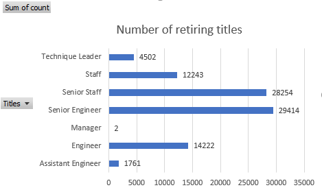
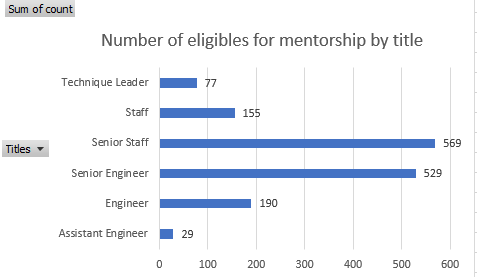
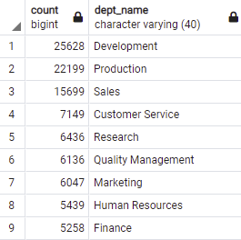
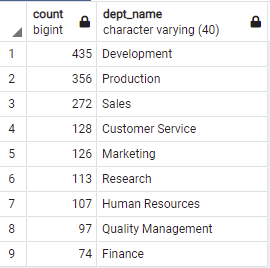

# Pewlett-Hackard HR Analysis

## Overview of the analysis: 
The following results present the number of retiring employees per title and the employees who are eligible for the mentorship program.

## Results: 
* The analysis shows that a total of 90398 employees are expected to retire.
* Figure 1 shows the total of expected retires parsed into titles
  ### Figure 1
  

* A total of 1549 employees were identified as eligible for the mentorship program
* Figure 2 demonstrates the number of eligible mentors by title
  ### Figure 2
  

## Summary:

According to Figure 1, approximately 64% of the expected retirees currently hold Senior positions, which requires the company to take significant action in replacing these roles. According to Figure 2, over 70% of the 1549 eligible mentors also currently hold Senior positions. It will be necessary to find replacement for 90398 roles in the company. Although Figure 2 demonstrates a corresponding ratio of mentors per retirees, it remains necesssary to assess the required scope and scale of the mentorship program. For that reason, it us necessary to conduct further analysis as suggested below. 

1. Count by title the number of eligible mentors using the following script:
   - NOTE: Figure 2 above demonstrates the results of this script, and mentorcount_by_title table can be found in the Data/ folder. 

```
SELECT title, COUNT(emp_no)
INTO mentorcount_by_title
FROM mentorship_eligibility
GROUP BY title;

```
2. Create a table the shows the department of each employee expected to retire
    - NOTE: Table retirees_by_department was added to Data/ folder

```
SELECT ut.emp_no,
	ut.first_name,
	ut.last_name,
	ut.title,
	d.dept_name
INTO retirees_by_department
FROM unique_titles AS ut
INNER JOIN dept_emp AS de ON (ut.emp_no = de.emp_no)
INNER JOIN departments AS d ON (de.dept_no = d.dept_no)
ORDER BY ut.emp_no;
```

3. The following query provides the count of retirees per department
    - NOTE: Table retireecount_by_department was added to Data/ folder. Figure 3 demonstrates the results of the query
```
SELECT COUNT(emp_no),
	dept_name
INTO retireecount_by_department
FROM retirees_by_department
GROUP BY dept_name
ORDER BY "count" DESC;
```
### Figure 3


4. Create a new table that shows the department of each mentor: 
   - NOTE: mentors_by_department table is added to Data/ folder

```
SELECT me.emp_no,
	me.first_name,
	me.last_name,
	me.title,
	d.dept_name
INTO mentors_by_department
FROM mentorship_eligibility AS me
INNER JOIN dept_emp AS de ON (me.emp_no = de.emp_no)
INNER JOIN departments AS d ON (de.dept_no = d.dept_no)
ORDER BY me.emp_no;

```

5. The following query provides the count of eligible mentors per department
    - NOTE: mentorcount_by_department table was added to the Data/ folder. Figure 4 demonstrates the results of the query.

```
SELECT COUNT(emp_no),
	dept_name
INTO mentorcount_by_department
FROM mentors_by_department
GROUP BY dept_name
ORDER BY "count" DESC;
```

### Figure 4

